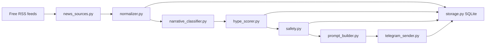

# Candle Craft X Hype Prompt Agent

## 1. What This Agent Does

The X Hype Prompt Agent is a standalone Telegram news-intelligence process. It scans configured free RSS feeds, normalizes and deduplicates crypto news, classifies narratives, scores each story for likely X engagement, and previews a copy-ready ChatGPT prompt. It sends to Telegram only when `--live-send` is explicitly provided.

The user manually pastes that prompt into ChatGPT Pro, reviews the output, and manually posts on X.

## 2. Why It Is Separate From The Live Candle Craft Bot

This agent is intentionally isolated from the existing Candle Craft Telegram signal bot:

- It has a separate runner: `scripts/run_x_hype_prompt_agent.py`
- It uses separate environment variables: `TELEGRAM_X_HYPE_BOT_TOKEN` and `TELEGRAM_X_HYPE_CHAT_ID`
- It uses a separate SQLite database: `scan_runs/x_hype_prompt_agent.sqlite`
- It does not import or change the live signal delivery flow
- It does not modify scanner alert behavior

The existing Candle Craft Telegram bot can continue running exactly as before.

## 3. Why It Is Free

The agent uses only:

- Free RSS feeds
- Local keyword-based classification
- Local deterministic scoring
- SQLite
- Telegram Bot API

It does not call OpenAI, X, paid news APIs, browser automation, paid market-data services, or paid image-generation APIs.

## 4. What It Does Not Do

This agent does not:

- Generate the final X post itself
- Call the OpenAI API
- Call the X API
- Auto-post to X
- Execute trades
- Reuse the existing Candle Craft Telegram bot token
- Send live trading signals

## 5. Architecture



## 6. Create A New Telegram Bot With BotFather

1. Open Telegram.
2. Start a chat with `@BotFather`.
3. Send `/newbot`.
4. Choose a display name, for example `Candle Craft X Hype`.
5. Choose a bot username ending in `bot`.
6. Copy the token into `.env` as `TELEGRAM_X_HYPE_BOT_TOKEN`.

Do not use the existing Candle Craft signal bot token.

## 7. Create The Private Telegram Group

1. Create a new private Telegram group.
2. Name it something like `Candle Craft X Hype Ideas`.
3. Keep it private unless you intentionally want others to see prompts.

## 8. Add The Bot To The Group

1. Open the private group.
2. Add the new bot as a member.
3. Send a test message in the group so Telegram creates an update for it.

## 9. Get The Telegram Chat ID

One simple method:

1. Temporarily run this in PowerShell after setting the bot token:

```powershell
$token = $env:TELEGRAM_X_HYPE_BOT_TOKEN
Invoke-RestMethod "https://api.telegram.org/bot$token/getUpdates"
```

2. Find the group `chat.id` value in the response.
3. Put it in `.env` as `TELEGRAM_X_HYPE_CHAT_ID`.

For groups, the chat ID is often negative.

## 10. Create The `.env` File

Add these values to the repo `.env` file:

```env
TELEGRAM_X_HYPE_BOT_TOKEN=replace-with-new-x-hype-bot-token
TELEGRAM_X_HYPE_CHAT_ID=replace-with-private-group-chat-id

X_HYPE_AGENT_DB_PATH=scan_runs/x_hype_prompt_agent.sqlite
X_HYPE_AGENT_LOG_LEVEL=INFO
```

Safe preview mode is the default and does not require the Telegram token or chat ID. `--dry-run` remains an optional compatibility flag.

## 11. Configure RSS Sources

Edit:

```text
config/x_hype_sources.yaml
```

Each source supports:

```yaml
- name: CoinDesk
  type: rss
  url: https://www.coindesk.com/arc/outboundfeeds/rss/
  tier: 1
  enabled: true
  categories:
    - markets
  reliability_weight: 1.05
  notes: Reputable major crypto/business news feed.
```

Tier guidance:

- Tier 1: official or highly reputable feeds
- Tier 2: useful crypto publications and analytics blogs
- Tier 3: noisy sources; best used only when stories cluster with stronger sources

If a feed is down or malformed, the agent logs the error and continues.

## 12. Run Safe Preview Mode (Default)

```powershell
python scripts/run_x_hype_prompt_agent.py --once --min-score 80 --max-prompts-per-run 3 --print-top 10 --include-rejected
```

Without `--live-send`, the agent prints the Telegram message to the console and never calls the Telegram transport. Adding `--dry-run` produces the same safe behavior.

## 13. Explicitly Send Telegram Prompts

```powershell
python scripts/run_x_hype_prompt_agent.py --once --live-send --min-score 82 --max-prompts-per-run 2
```

Live-send mode requires the explicit `--live-send` opt-in and:

- `TELEGRAM_X_HYPE_BOT_TOKEN`
- `TELEGRAM_X_HYPE_CHAT_ID`

## 14. Run Watch Mode

```powershell
python scripts/run_x_hype_prompt_agent.py --watch --watch-interval-sec 3600 --min-score 80 --max-prompts-per-run 2
```

This watch command remains in safe preview mode. Add `--live-send` only after configuring and verifying the dedicated X Hype bot credentials. `--dry-run` and `--live-send` cannot be combined.

If neither `--once` nor `--watch` is provided, the runner defaults to one safe preview scan and exits.

## 15. Windows Task Scheduler Setup

Recommended approach: run once every 60 minutes.

1. Open Windows Task Scheduler.
2. Create Basic Task.
3. Trigger: Daily, repeat every 1 hour.
4. Action: Start a program.
5. Program/script:

```text
python
```

6. Arguments:

```text
scripts/run_x_hype_prompt_agent.py --once --min-score 82 --max-prompts-per-run 2
```

7. Start in:

```text
C:\CandleCraftDev
```

If the project uses a virtual environment, use:

```text
C:\CandleCraftDev\.venv\Scripts\python.exe
```

## 16. Recommended Settings

- Scan every 60 minutes
- `min_score_to_send`: 80 to 85
- `max_prompts_per_run`: 2
- `max_prompts_per_day`: 5 to 7
- `breaking_news_score`: 90+
- Keep `allow_tier_3_only_items: false`

## 17. Telegram Prompt Format And ChatGPT Output

Telegram messages are intentionally compact. The visible Telegram wrapper only shows:

- `🟠 CCI X PROMPT`
- `Score: <score>/100 | <category> | <source>`
- `Copy into ChatGPT:`
- The copy-ready ChatGPT prompt

The prompt asks ChatGPT Pro to return a complete X content package, not an article. Both X post versions must be maximum 240 characters total, including body text, line breaks, one compact brand ending, and hashtags. Hashtags are included inside each post, at the end of the post, with exactly 3 relevant hashtags by default and a 4th only if the post still fits under 240 characters.

The ChatGPT output also includes an image-generation prompt and alt text. The image prompt is designed for a 16:9 X post image in Candle Craft premium dark/orange/gold style. Alt text should be 1 to 2 short descriptive sentences with no hashtags and no financial advice.

## 18. Example Telegram Message

```text
🟠 CCI X PROMPT

Score: 88/100 | ETF_FLOW | CoinDesk

Copy into ChatGPT:

Act as the Candle Craft Intelligence X content writer.

Create a short X content package from this crypto news.

Headline:
Bitcoin ETF inflows surge as BlackRock demand returns

Source:
CoinDesk - https://example.com/story

Category:
ETF_FLOW

Why it matters:
ETF flow stories create immediate debate around institutional demand and spot market liquidity.

Market angle:
Frame this as a liquidity-flow question: are institutions adding demand, removing demand, or changing trader expectations?

Visual angle:
Institutional liquidity flow graphic with BTC/ETH, ETF-style inflow arrows, dark premium trading desk atmosphere.

Rules:
- Write for crypto traders.
- Do not write a news article.
- Each X post must be maximum 240 characters total, including hashtags and brand ending.
- Use exactly 3 relevant hashtags by default.
- Use 4 hashtags only if the post stays under 240 characters.
- Hashtags go at the end.
- Use one compact brand ending.
- No financial advice.
- Do not invent facts beyond the headline and source.

Return exactly:

1. Short X post
<post>
Character count: <number>

2. More aggressive engagement version
<post>
Character count: <number>

3. Image-generation prompt
<16:9 image prompt>

4. Alt text
<1 to 2 sentence alt text>

5. Optional thread angle
<thread angle or "No thread needed.">
```

The Telegram bot sends the prompt only. It does not generate the final posts, create images, call paid APIs, or post to X.

## 19. How To Use The Prompt In ChatGPT Pro

1. Copy everything below `Copy into ChatGPT:`.
2. Paste it into ChatGPT Pro.
3. Review the generated X posts and confirm each post is under 240 characters including hashtags and brand ending.
4. Verify the source manually if the story is sensitive.
5. Manually post to X.

The agent does not create the final post and does not auto-post.

## 20. Tune Scoring

Scoring lives in:

```text
src/x_hype_prompt_agent/hype_scorer.py
```

Narrative rules live in:

```text
src/x_hype_prompt_agent/narrative_classifier.py
```

Useful tuning levers:

- Raise `min_score_to_send` if too many prompts are generic
- Lower `max_prompts_per_day` if the group is noisy
- Disable high-noise feeds
- Increase tier/reliability for sources you trust
- Add narrative keywords for new market themes

## 21. Troubleshooting

No Telegram message:

- Run without `--live-send` first (or add the compatibility `--dry-run` flag)
- Confirm the new bot is in the private group
- Confirm `TELEGRAM_X_HYPE_BOT_TOKEN`
- Confirm `TELEGRAM_X_HYPE_CHAT_ID`
- Check that the score is above the configured minimum

Too many weak stories:

- Raise `--min-score`
- Disable noisy feeds
- Keep tier 3 sources disabled

No stories found:

- Use `--print-top 10`
- Check RSS URLs
- Temporarily lower `--min-score` during testing

Duplicate prompts:

- The agent rejects similar sent prompts within `duplicate_window_days`
- Increase `duplicate_window_days` if repeated narratives are still too frequent

Feed errors:

- The agent logs and continues
- Replace invalid URLs in `config/x_hype_sources.yaml`

