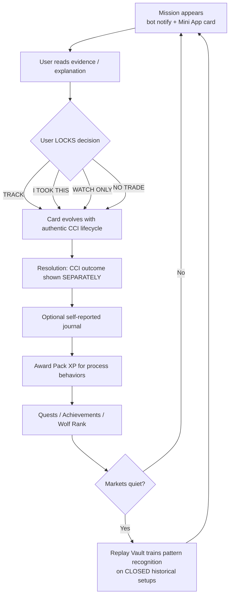
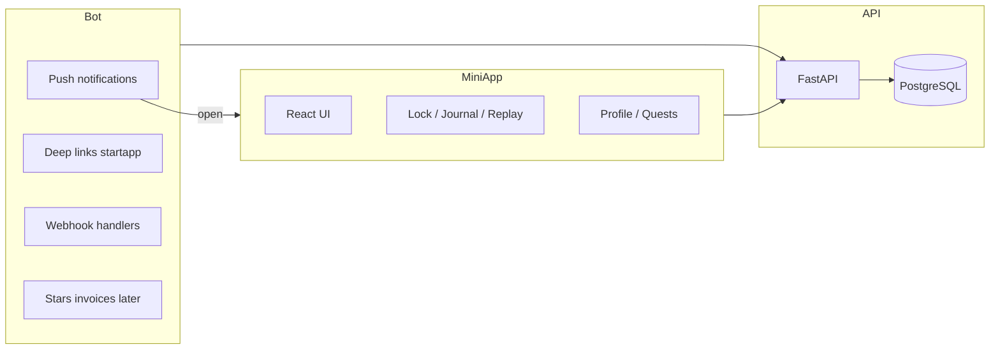
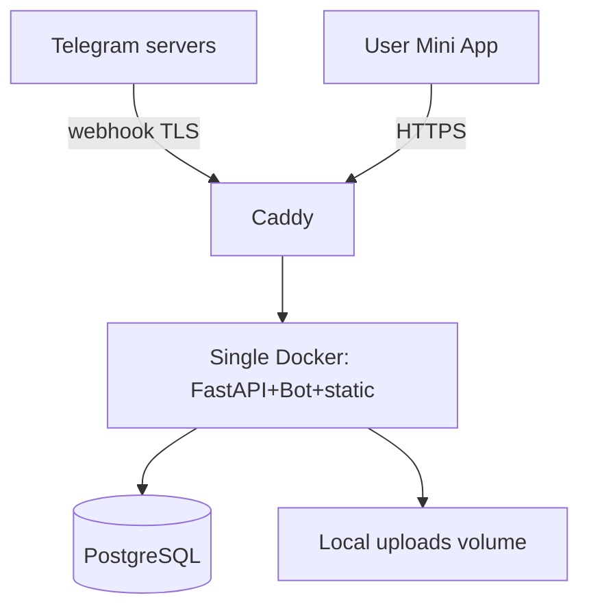

# CCI The Pack — Product Architecture

**Document status:** FINAL — locked product decisions. Do not reopen naming, core loop, anti-overtrading rules, MVP screen set, or tech stack in implementation PRs. Implement against this document.

---

## 1. EXECUTIVE CONCEPT

Candle Craft Intelligence (CCI) is a professional market-structure intelligence framework. Its philosophy is fixed: **QUALITY > QUANTITY**. Setups are scarce, evidence-backed, and lifecycle-governed. Traders who follow CCI correctly spend most of their time *not* trading.

**CCI The Pack** is the Telegram-native interactive layer that sits *beside* CCI — never inside its runtime. The Pack turns following CCI into a premium intelligence + discipline game. It does not execute orders, does not claim profitability, and does not operate as a casino. It rewards process: reading evidence, locking a pre-outcome decision, journaling honestly, reviewing after resolution, choosing **NO TRADE**, and training pattern recognition on closed historical setups in the Replay Vault.

The emotional contract is belonging, not competition theater:

> **"I am part of the Pack."**

You are not a lone signal-chaser. You are a member of a disciplined cohort that respects structure, waits for quality, and measures itself by process fidelity — not by trade count or leverage.

The Pack's north star is retention *without* overtrading. Every XP rule, quest, achievement, rank unlock, and empty-state path is designed so that the highest-scoring behaviors are the ones that protect capital and attention. When markets are quiet, the product does not invent fake urgency; it routes users into Replay Vault and reflective quests.

**What The Pack is:** a Telegram Mini App + bot companion that presents CCI public setups as **Missions**, lets users lock TRACK / I TOOK THIS / WATCH ONLY / NO TRADE, evolves cards only along authentic CCI lifecycle events, separates authoritative CCI outcomes from optional self-reported journals, and awards **Pack XP** toward **Wolf Rank**.

**What The Pack is not:** a broker, a signal dump, a PnL leaderboard, a PvP arena, a token, a wallet, or a pay-to-win trading edge.

---

## 2. FINAL PRODUCT NAME + TAGLINE

| Decision | Value |
|---|---|
| **Final product name** | **CCI The Pack** |
| **Short UI name** | **The Pack** |
| **Tagline** | **Profit is the outcome. Discipline is the game.** |
| **XP currency** | **Pack XP** (no cash value in MVP) |
| **Rank system** | **Wolf Rank** |

### Rejected alternatives (one-line why each lost)

| Name | Why rejected |
|---|---|
| **PACK ARENA** | Working title only. "Arena" implies combat/PvP and directly conflicts with anti-overtrading philosophy. |
| **SIGNAL ARENA** | Doubles down on signal-dump + combat framing; erases discipline identity. |
| **WOLF OPS** | Sounds like militarized call-of-duty cosplay; premium institutional tone lost. |
| **MISSION CONTROL** | Generic NASA pastiche; weak belonging narrative; no Pack identity. |

**Brand rationale:** "The Pack" means belonging — shared standards, shared language, shared restraint. "Arena" was retired precisely because it framed the product as fight-to-win rather than wait-to-quality.

---

## 3. WHY THIS PRODUCT CAN WORK

### Retention without overtrading

Most trading apps retain users by manufacturing urgency: more alerts, more trades, more FOMO. CCI already owns scarce, high-quality setups. The Pack monetizes *attention to process* around those setups. Users return to lock decisions, complete journals, review outcomes, and run Replays — activities that do not require a live market to be valuable.

### Telegram-native distribution

The audience already lives in Telegram. Mini Apps + bot push give zero-install distribution, deep links into Mission Detail, theme-aware UI, haptics, and later Stars monetization — without building a separate mobile client.

### CCI differentiation

Signal channels are commodity. CCI's lifecycle-governed setup intelligence is not. The Pack is the only interactive layer that (a) refuses to invent transitions, (b) separates authoritative outcomes from user journals, and (c) scores **NO TRADE** as first-class.

### Buildable by one founder + AI agents

Single FastAPI process, one React Mini App, Postgres, Docker on a €4–5 VPS. Protocol interface + MockFixtureSource for Phase 0/1 means product can be shipped and demoed before live CCI bridge. No microservices, no K8s, no exchange APIs.

---

## 4. CORE USER LOOP



### Session lengths (target)

| Session type | Duration | Trigger |
|---|---|---|
| Mission lock | 45–90 seconds | Bot push → open Mission Detail → lock |
| Journal / review | 2–4 minutes | Post-resolution CTA |
| Replay drill | 3–6 minutes | Empty state or daily quest |
| Profile / collectibles | 30–60 seconds | Rank-up or achievement |

### Empty state (no live missions)

When there are zero open Missions:

1. Home surfaces **Replay Vault** spotlight + 1–2 active quests.
2. Bot may send a soft "Pack training" nudge (user-toggleable), never fake urgency.
3. Copy: *"The Pack waits. Quality is scarce. Train while the market sleeps."*

Never invent Missions. Never recycle open setups as "new."

---

## 5. SIGNAL MISSION SYSTEM

### Naming: Mission vs Hunt

**Decision (locked):** All interactive units are **Missions**.

**"Hunt"** is an optional **quality-tier label** applied only to setups that CCI marks as high-conviction / high-quality. It is a badge on a Mission card, not a separate product object. Do not create a parallel Hunt entity in MVP.

### Mission card fields (MVP)

| Field | Source | Notes |
|---|---|---|
| `mission_id` | Pack UUID | Pack-owned primary key |
| `cci_setup_id` | CCI | External idempotent reference |
| `title` / `symbol` / `timeframe` | CCI public | Display only |
| `quality_tier` | CCI → mapped | e.g. STANDARD / HUNT |
| `thesis_summary` | CCI public explanation | Read-only |
| `evidence_blocks` | CCI | Structure / levels / context snippets |
| `lifecycle_state` | CCI event stream | Authoritative |
| `opened_at` / `resolved_at` | CCI | Timestamps |
| `outcome_code` | CCI | e.g. TP_HIT, INVALIDATED, EXPIRED — never invented |
| `user_decision` | Pack | TRACK / I_TOOK_THIS / WATCH_ONLY / NO_TRADE / null |
| `decision_locked_at` | Pack | Immutable once set (MVP) |

### Lifecycle states (map from CCI; NEVER invent)

Pack displays states only as emitted by CCI. Illustrative mapping (exact enum comes from CCI public contract in Phase 2):

| CCI lifecycle (illustrative) | Pack UI treatment |
|---|---|
| `PUBLISHED` / `ACTIVE` | Mission open — lock CTA enabled |
| `PARTIAL` / `UPDATE` | Lifecycle pulse; lock still allowed if pre-outcome policy says so |
| `TP1` / `TP2` / `TARGET_HIT` | Outcome path; lock may freeze |
| `INVALIDATED` / `STOPPED` | Resolved — show CCI outcome |
| `EXPIRED` / `CLOSED` | Resolved — show CCI outcome |

**Hard rule:** The Pack NEVER invents transitions, NEVER advances state locally, NEVER "predicts" next state for UX candy.

### User actions before outcome

Exactly four lock options:

1. **TRACK** — following for learning; no self-claim of entry.
2. **I TOOK THIS** — self-report of participation (not verified execution).
3. **WATCH ONLY** — intentional observation without commitment.
4. **NO TRADE** — deliberate pass; equal or higher XP than I TOOK THIS.

Lock is required before certain community reactions (Phase 3) and before claiming review XP.

### Journal fields (optional, post-resolution)

- `emotional_state` (enum: calm / FOMO / revenge / confident / uncertain)
- `process_notes` (short text, capped)
- `followed_plan` (bool)
- `screenshot_url` (optional; Phase 1+ storage)
- `self_reported_result` (enum; clearly labeled USER-REPORTED)

### Outcome separation (mandatory UI)

Always render two distinct blocks:

1. **CCI Outcome** — authoritative, read-only, source-labeled.
2. **Your Journal** — optional, self-reported, never merged into CCI outcome.

Copy template: *"CCI outcome is independent of your journal. Journal is for your process — not proof of PnL."*

---

## 6. XP / PROGRESSION SYSTEM

**Currency:** Pack XP — prestige only in MVP. No cash value. No conversion.

### Pack XP rules (concrete amounts)

| Behavior | XP | Notes |
|---|---|---|
| Open Mission Detail + evidence read (≥8s dwell or scroll-to-end) | +5 | Once per mission |
| Lock decision: **NO TRADE** | +25 | Equal-or-more than entry |
| Lock decision: **TRACK** | +15 | |
| Lock decision: **WATCH ONLY** | +15 | |
| Lock decision: **I TOOK THIS** | +20 | Less than NO TRADE |
| Complete journal after resolution | +30 | |
| Complete post-outcome review checklist | +20 | |
| Replay attempt completed | +15 | |
| Replay high score (≥80% rubric) | +25 | Bonus, capped |
| Daily quest complete | +40 | |
| Weekly quest complete | +100 | |
| Achievement unlock | +50–150 | By rarity |

### Daily caps & anti-farm

| Category | Daily cap |
|---|---|
| Decision locks | 80 XP |
| Journals / reviews | 100 XP |
| Replay | 90 XP |
| Quests | 140 XP |
| Total soft daily ceiling | ~350 XP (diminishing after 70% of each category) |

Diminishing returns: after 3 Replay attempts/day, XP per attempt ×0.5; after 5, ×0.25.

**Explicitly never rewarded:** more trades, higher leverage, larger size, higher PnL, streak of I TOOK THIS alone.

### Streak rules

- **Discipline Streak:** consecutive calendar days with ≥1 process action (lock OR journal OR Replay). NOT trade streak.
- Miss a day → streak freezes at grace of 1 day if user opens app and completes any process action within 36h.
- Streak XP: +10 at day 3, +20 at day 7, +40 at day 14 — then weekly pulse, not exponential.

### Wolf Rank thresholds

| Rank | Cumulative Pack XP | Unlock (cosmetic only) |
|---|---|---|
| **SCOUT** | 0 | Default badge |
| **TRACKER** | 250 | Frame: steel ring |
| **HUNTER** | 750 | Badge glow (restrained amber) |
| **PATHFINDER** | 1,800 | Profile title + card watermark |
| **VANGUARD** | 4,000 | Animated rank seal (reduced motion aware) |
| **ELITE** | 8,500 | Full Pack crest + share card |

Thresholds are achievable with ~2–4 weeks of daily discipline for TRACKER→HUNTER, months for ELITE — not farmable in a weekend.

Unlocks are **cosmetic only**. No trading advantage. No XP multipliers by rank.

---

## 7. QUEST SYSTEM

Quests reinforce process. They never require taking a trade.

### Placement

- Home module: "Today's Quests" (max 3 visible)
- Mission Detail CTAs: contextual quest progress chips
- **Not** a 6th top-level screen

### Daily examples

| Quest | Completion | XP |
|---|---|---|
| Read & lock 1 Mission (any decision) | Lock once | +40 |
| Choose NO TRADE deliberately | Lock NO TRADE | +40 |
| Complete 1 journal | Submit journal | +40 |
| Run 1 Replay | Finish attempt | +40 |
| Open Mission Detail evidence fully | Dwell/scroll rule | +40 |

### Weekly examples

| Quest | Completion | XP |
|---|---|---|
| 3 journals this week | Count | +100 |
| 2 NO TRADE locks | Count | +100 |
| 5 Replay attempts | Count | +100 |
| Maintain Discipline Streak ≥5 days | Streak check | +100 |

### Rotation

- Daily pool: 5 templates → surface 2–3 per user/day (deterministic seed = user_id + date).
- Weekly: 3 templates → surface 2.
- Never rotate in "take N trades" quests.

---

## 8. ACHIEVEMENTS

~18 achievements emphasizing discipline. Categories: Process, Restraint, Review, Replay, Belonging.

| ID | Name | Category | Rarity | Rule (summary) |
|---|---|---|---|---|
| A01 | First Lock | Process | Common | Lock any decision once |
| A02 | Evidence Reader | Process | Common | Full evidence read ×5 |
| A03 | Journal Ink | Review | Common | 3 journals |
| A04 | Clean Pass | Restraint | Rare | NO TRADE ×10 |
| A05 | Patient Scout | Restraint | Rare | NO TRADE on a HUNT-tier Mission |
| A06 | Review Ritual | Review | Rare | Review checklist ×10 |
| A07 | Replay Initiate | Replay | Common | Complete 5 Replays |
| A08 | Pattern Eye | Replay | Rare | ≥80% score ×5 Replays |
| A09 | Quiet Week | Restraint | Epic | Full week with ≥1 process/day and 0 I TOOK THIS |
| A10 | Streak Seven | Belonging | Rare | Discipline Streak 7 |
| A11 | Streak Thirty | Belonging | Epic | Discipline Streak 30 |
| A12 | Pathwalker | Process | Rare | Reach PATHFINDER |
| A13 | Vanguard Seal | Belonging | Epic | Reach VANGUARD |
| A14 | Elite Howl | Belonging | Legendary | Reach ELITE |
| A15 | Outcome Separatist | Review | Rare | View CCI outcome + submit journal on same Mission ×5 |
| A16 | No Chase | Restraint | Epic | After INVALIDATED Mission, next lock is NO TRADE or WATCH ONLY |
| A17 | Vault Dweller | Replay | Rare | 25 Replay completions |
| A18 | Pack Oath | Belonging | Common | Complete onboarding + first lock |

### Explicitly banned achievement types

- Highest PnL / biggest win
- Most trades / most I TOOK THIS
- Highest leverage / size
- Win-rate leaderboards
- Anything implying CCI or Pack guarantees profit
- Pay-to-unlock achievements

---

## 9. REPLAY VAULT

Replay Vault trains pattern recognition on **CLOSED historical setups only**.

### Flow

1. User opens Replay from Home empty state, Replay tab, or quest CTA.
2. Selects a closed Mission fixture (symbol hidden or partially masked until reveal — product choice: **masked chart context + thesis stripped of outcome**).
3. User studies structure; chooses what they would have done: TRACK / TAKE / WATCH / NO TRADE (Replay decision — labeled as training, not live).
4. Optionally marks key levels / bias in lightweight UI.
5. Reveal: show actual CCI historical lifecycle + outcome.
6. Score against rubric (process alignment, not "would you have made money").
7. Award Pack XP per §6; show disclaimer.

### Scoring rubric (MVP)

| Dimension | Weight |
|---|---|
| Correct quality recognition (Hunt vs pass) | 40% |
| Decision class alignment with post-hoc teaching note | 40% |
| Evidence attention (time + interaction) | 20% |

Scores are **training scores**, not performance proof.

### Disclaimer language (always visible on reveal)

> *"Replay scores measure pattern recognition practice on closed historical setups. They do not predict future results. Past CCI setups do not guarantee future performance. The Pack never executes trades."*

### XP

Base +15 complete; +25 bonus if score ≥80%; subject to daily Replay caps.

---

## 10. PROFILE / COLLECTION

### Fields shown

- Display name (Telegram first name / custom Pack handle)
- Wolf Rank + progress bar to next rank
- Pack XP (lifetime + 7-day sparkline of process XP, not PnL)
- Discipline Streak
- Achievement shelf (unlocked + locked silhouettes)
- Cosmetic frame / badge
- Counts: Missions locked, NO TRADE ratio, Journals, Replays (process stats)

### What NOT to show

- Monetary PnL
- Trade-count leaderboards
- "Top earners"
- Verified exchange balances
- Any cash value of Pack XP

### Collectibles (light for MVP)

- Rank frames
- Achievement seals
- Seasonal crest placeholder (Season 01 art locked, unlock deferred to Phase 3)

---

## 11. COMMUNITY MECHANICS

Tasteful, optional, non-toxic.

### MVP (light)

- Share card for rank-up / achievement (static image or shareToStory later)
- No global chat inside Mini App required

### Phase 3+

- Pack-wide progress meter (aggregate process XP — not PnL)
- Reaction-to-closed-signals **only after** the user has locked their own decision on that Mission
- No toxic PnL comparisons; no "call out" features
- Optional anonymous Pack pulse: "% who chose NO TRADE on this Mission" — after resolution only

---

## 12. ANTI-OVERTRADING DESIGN

Checklist — encode in product, XP, copy, and QA:

- [ ] Never reward more trades, higher leverage, larger size, or higher PnL
- [ ] NO TRADE XP ≥ I TOOK THIS XP for locking
- [ ] Journal/review XP > entry/lock XP for I TOOK THIS path
- [ ] Category XP daily caps + diminishing returns
- [ ] No profit multiplier; no leverage multiplier
- [ ] No trade-count leaderboard
- [ ] Separate CCI outcome from user self-report always
- [ ] Empty state → Replay + quests, never fake Missions
- [ ] Quests never require taking a trade
- [ ] Achievements ban PnL / trade-count / leverage types
- [ ] Rank unlocks cosmetic only
- [ ] Notifications: critical lifecycle only by default; gamification toggles off-able
- [ ] Copy never promises profit; tagline frames profit as *outcome*, discipline as *game*

---

## 13. MVP SCREENS + UX

Bottom nav (exactly 4 tabs): **Home | Missions | Replay | Profile**

Mission Detail is pushed from Missions (or deep link) — not a tab.

### 13.1 Command Center (Home)

- **Purpose:** Orientation — live Pack pulse, quests, streak, next action.
- **Above-the-fold:** Wolf Rank chip + Discipline Streak; primary CTA ("Open live Mission" or "Train in Replay"); Today's Quests module.
- **Primary actions:** Jump to top Mission; start Replay; claim quest.
- **Delight:** Soft amber pulse when a new Mission arrives; restrained rank progress shimmer.

### 13.2 Missions

- **Purpose:** List open + recently resolved Missions.
- **Above-the-fold:** Filter chips (Open / Resolved / Mine); top open Mission card.
- **Primary actions:** Open Mission Detail; lock from card if already read (optional shortcut).
- **Delight:** Lifecycle pulse on state change (haptic `notification` + subtle border breath).

### 13.3 Mission Detail

Structure (exact):

1. Header: symbol, timeframe, quality tier (HUNT badge if applicable), lifecycle chip
2. Evidence / explanation stack (scroll)
3. **Lock panel** (sticky): TRACK | I TOOK THIS | WATCH ONLY | NO TRADE
4. Lifecycle timeline (CCI events only)
5. **CCI Outcome block** (when resolved) — authoritative
6. **Your Journal block** — optional, separate
7. XP earned strip + quest CTAs
8. Share (rank/achievement only; not raw "I won")

Delight moments: mission reveal entrance; lifecycle pulse; TP unlock animation (celebration restrained — institutional, not slot-machine); post-lock haptic `impact`.

### 13.4 Replay Vault

- **Purpose:** Train on closed setups when quiet.
- **Above-the-fold:** "Closed setups ready" count; Start Replay CTA; last score.
- **Primary actions:** Start attempt; review teaching note.
- **Delight:** Reveal flip from masked → full outcome; score seal.

### 13.5 Pack Profile

- **Purpose:** Identity, rank, achievements, process stats.
- **Above-the-fold:** Crest + Wolf Rank + XP to next.
- **Primary actions:** View achievements; share rank card; open settings (notification toggles).
- **Delight:** Rank-up full-screen seal (once); achievement unlock toast.

---

## 14. BOT / MINI APP INTERACTION



### Responsibility split

| Concern | Bot | Mini App |
|---|---|---|
| New Mission alert | Yes | Shows card |
| Lifecycle critical update | Yes (toggleable severity) | Live refresh |
| Lock / journal / Replay | Deep link in | Yes — primary |
| Onboarding | /start + brief | Full Pack Oath |
| Settings toggles | Commands optional | Full UI |
| Monetization (later) | Invoices | Paywall screens |

### Notification taxonomy

| Type | Default | User toggle |
|---|---|---|
| New Mission | On | Critical |
| Lifecycle resolution | On | Critical |
| Quest complete | Off | Gamification |
| Rank-up | On | Gamification |
| Streak at risk | Off | Gamification |
| Replay nudge (quiet market) | Off | Training |

Non-critical gamification notifications are off by default or easily disabled.

---

## 15. VISUAL DESIGN SYSTEM

### Locked language

- Motif: **cybernetic wolf** — precise, loyal, restrained
- Palette: black / charcoal / gunmetal; **restrained amber** accents
- Aesthetic: HUD + institutional luxury
- Explicitly NOT: casino gold spam, meme wolves, slot motifs, neon carnival

### Component tokens (indicative)

| Token | Value |
|---|---|
| `--bg-void` | `#0B0D10` |
| `--bg-panel` | `#14181E` |
| `--border-gun` | `#2A3038` |
| `--text-primary` | `#E8EAED` |
| `--text-muted` | `#9AA3AD` |
| `--accent-amber` | `#C7923E` |
| `--accent-amber-dim` | `#8A642C` |
| `--state-live` | `#3D7EA6` |
| `--state-resolved` | `#5A6B5C` |
| `--danger` | `#8B3A3A` |

Typography: one geometric sans for UI; monospace for HUD readouts (XP, IDs).

### Motion principles

- Framer Motion: short (180–280ms), ease-out, purposeful
- Celebrate with seal/crest, not confetti explosions
- Respect Telegram `performance_class`: on **LOW**, reduce or disable non-essential motion; prefer opacity/transform only when needed

---

## 16. CURRENT TELEGRAM CAPABILITY RESEARCH

Research basis: official Telegram docs at **core.telegram.org** (Bots / Mini Apps / Payments Stars). Capabilities below reflect what is documented for product planning as of this architecture date; implementers must re-verify against live Bot API release notes before coding each feature.

### Available now — use in MVP

| Capability | Use in The Pack |
|---|---|
| Main Mini App (BotFather Launch app, profile previews, Apps discovery) | Primary client |
| Menu button / inline `web_app` buttons | Entry points |
| Deep links `t.me/bot?startapp=` and `t.me/bot/app?startapp=` | Mission Detail routing |
| `initData` server-side HMAC validation | **Mandatory** auth |
| `expand()`, `themeParams`, BackButton, MainButton/SecondaryButton, SettingsButton | Chrome integration |
| HapticFeedback (impact / notification / selectionChanged) | Lock, lifecycle, rank-up |
| CloudStorage | Prefs sync |
| DeviceStorage (Bot API 9.0+) | Local cache prefs |
| `shareToStory` (Bot API 7.8+) | Later share polish; optional late MVP |
| Bot push via Bot API messages | Mission / resolution alerts |
| Vertical swipe control; closing confirmation | Prevent accidental dismiss mid-lock |

### Useful later (Phase 3–5)

| Capability | Phase use |
|---|---|
| `requestFullscreen` / `exitFullscreen` + `safeAreaInset` (Bot API 8.0+) | Cinematic Mission Detail / Replay |
| `addToHomeScreen` / `checkHomeScreenStatus` | Retention |
| `shareMessage` + PreparedInlineMessage | Pack share cards |
| Stars subscriptions / gifts | VIP / season pass |
| Emoji status sync | Rank badges |
| BotFather loading screen customization | Brand polish |

### Not needed for MVP

- Attachment menu (restricted)
- Geolocation, accelerometer, gyroscope, biometrics
- Multiplayer chat-context Mini Apps
- Blockchain / wallets

Official references to consult during implementation: `core.telegram.org/bots/webapps`, `core.telegram.org/bots/api`, `core.telegram.org/bots/payments-stars`.

---

## 17. MONETIZATION / TELEGRAM STARS

### MVP

**Engagement-first. NO Stars. No monetization engineering.** No invoices, no paywalls, no VIP flags in schema beyond a nullable placeholder if needed for forward-compat (prefer omit until Phase 4).

### Stars rules (from core.telegram.org/bots/payments-stars) — for Phase 4 design

- Digital goods **inside Telegram** must use Stars (currency **XTR**)
- Empty `provider_token`; exactly one price item
- Flow: `sendInvoice` → `pre_checkout_query` (answer within **10s**) → `successful_payment` → deliver
- Store `telegram_payment_charge_id`; support `/paysupport` + `refundStarPayment`

### Future allowed uses ONLY

- VIP access (extra Replay slots, cosmetic seasons)
- Cosmetics / season pass
- Premium Replay packs

### Hard bans

- Pay-to-win trading advantage
- Gambling, wagers, randomized financial payouts
- Selling "signals as bets"
- Any implication that payment improves CCI accuracy

### Legal note

Any future monetary rewards outside Telegram's Stars framework require separate legal review (jurisdiction, gambling law, financial promotion rules). Default posture: **no real-money rewards**. Pack XP remains non-redeemable.

---

## 18. DATA MODEL

Conceptual entities. **CCI-owned** = read-only mirror/reference. **Pack-owned** = writable by The Pack.

### users (Pack-owned)

`id`, `telegram_user_id` (unique), `username`, `display_name`, `wolf_rank`, `pack_xp`, `discipline_streak`, `streak_updated_on`, `notification_prefs` (JSONB), `created_at`, `last_seen_at`

### missions (Pack-owned shell + CCI refs)

`id`, `cci_setup_id` (unique idempotency), `symbol`, `timeframe`, `quality_tier`, `title`, `thesis_summary`, `evidence_json`, `lifecycle_state`, `opened_at`, `resolved_at`, `outcome_code`, `outcome_payload_json`, `source` (mock|live), `created_at`, `updated_at`

### mission_lifecycle_events (Pack-owned log of CCI events)

`id`, `mission_id`, `cci_event_id` (unique idempotency), `event_type`, `payload_json`, `occurred_at`, `ingested_at`

### user_mission_decisions (Pack-owned)

`id`, `user_id`, `mission_id`, `decision` (TRACK|I_TOOK_THIS|WATCH_ONLY|NO_TRADE), `locked_at`, unique(`user_id`,`mission_id`)

### journals (Pack-owned)

`id`, `user_id`, `mission_id`, `emotional_state`, `process_notes`, `followed_plan`, `self_reported_result`, `screenshot_url`, `created_at`, `updated_at`

### xp_ledger (Pack-owned)

`id`, `user_id`, `amount`, `category`, `reason_code`, `ref_type`, `ref_id`, `created_at`, `idempotency_key` (unique)

### quests (Pack-owned)

`id`, `code`, `cadence` (daily|weekly), `title`, `rule_json`, `xp_reward`, `active`

### quest_completions (Pack-owned)

`id`, `user_id`, `quest_id`, `period_key` (e.g. 2026-09-21), `completed_at`, unique(`user_id`,`quest_id`,`period_key`)

### achievements / user_achievements (Pack-owned)

`achievements`: `id`, `code`, `name`, `category`, `rarity`, `rule_json`, `xp_reward`
`user_achievements`: `user_id`, `achievement_id`, `unlocked_at`, unique pair

### season_progress (deferred — Phase 3)

`user_id`, `season_code`, `xp`, `tier`, `updated_at` — table may exist empty; no Season UI in MVP.

### replay_challenges (Pack-owned; content may mirror closed CCI)

`id`, `source_mission_id` (nullable), `fixture_json`, `teaching_note`, `rubric_json`, `active`

### replay_attempts (Pack-owned)

`id`, `user_id`, `challenge_id`, `decision`, `score`, `detail_json`, `created_at`

**Never store:** exchange API keys, order intents, broker credentials, CCI Runtime internal tables.

---

## 19. CCI READ-ONLY INTEGRATION CONTRACT

```
CCI (public/read-only event/API layer)
        ↓
  CciMissionSource (protocol)
        ↓
   The Pack ingest
```

### Protocol

```python
class CciMissionSource(Protocol):
    def list_open_setups(self) -> list[CciSetupDTO]: ...
    def get_setup(self, cci_setup_id: str) -> CciSetupDTO: ...
    def iter_events_since(self, cursor: str | None) -> Iterable[CciEventDTO]: ...
```

### Event types (illustrative; finalize in Phase 2)

`SETUP_PUBLISHED`, `LIFECYCLE_UPDATED`, `SETUP_RESOLVED`

Each event carries: `cci_event_id` (idempotency), `cci_setup_id`, `occurred_at`, `state`, `payload`.

### Idempotency

Ingest on `cci_event_id` unique constraint. Replays of the same event are no-ops.

### Phase 0/1: MockFixtureSource

Ship JSON fixtures under `fixtures/missions/*.json` implementing the same DTOs. Product UX develops entirely against mocks.

### Phase 2: Live read-only bridge

Read-only HTTP/event consumer. Credentials are pull-only. **The Pack NEVER writes to CCI Runtime DB, never changes lifecycle, never executes orders.**

### Explicit boundary

> **DO NOT modify production CCI Runtime.** No migrations against CCI DB. No shared write transactions. Integration is one-way.

---

## 20. SECURITY / ABUSE PREVENTION

### initData validation (mandatory)

1. Parse Telegram WebApp `initData` query string.
2. Compute HMAC-SHA256 using secret key = HMAC-SHA256(bot_token, key="WebAppData") per Telegram docs.
3. Compare `hash`; reject on mismatch / missing.
4. Enforce `auth_date` freshness (e.g. ≤ 24h, tighter for sensitive actions).
5. **Never trust** `telegram_user_id` from JSON body alone — bind session to validated initData user.

### Auth

- Mini App: validated initData → server session / JWT (short-lived) scoped to telegram user.
- Bot webhooks: verify Telegram webhook secret token header.

### Rate limits

- Lock decision: 1 per mission (immutable MVP); API still rate-limited.
- XP award endpoints: server-side only; client cannot POST raw XP.
- Replay starts: ≤10/hour/user.
- Journal submit: ≤20/hour/user.

### Idempotency & dedupe

- `xp_ledger.idempotency_key`
- `mission_lifecycle_events.cci_event_id`
- Quest completions unique on period key

### Uploads

- Screenshots: type allowlist (jpeg/png/webp), max 2MB, virus-scan optional later; store outside web root.

### Abuse

- Ban automation that spam-locks; anomaly on XP velocity.
- No public enum of other users' I TOOK THIS before resolution (privacy + anti-herding).

---

## 21. RECOMMENDED TECH STACK

| Layer | Choice |
|---|---|
| Frontend | React 18 + TypeScript + Vite + `telegram-web-app.js` + Framer Motion |
| Backend | Single Python FastAPI (API + webhook bot handlers, one process MVP) |
| Bot | python-telegram-bot **or** aiogram (pick one; prefer aiogram 3 if greenfield) |
| DB | PostgreSQL (Neon free or VPS); SQLAlchemy 2 + Alembic |
| Storage | Local disk Phase 0/1; optional R2/S3 later |
| CCI | `CciMissionSource` + `MockFixtureSource`; live in Phase 2 |
| Deploy | One Docker container; Caddy/nginx TLS |

### Suggested repo layout (AI-buildable)

```
pack/
  apps/web/                 # Vite React Mini App
  apps/api/                 # FastAPI
    app/
      api/                  # HTTP routes
      bot/                  # handlers
      domain/               # XP, quests, ranks
      integrations/cci/     # protocol + mock + live
      models/               # SQLAlchemy
      security/             # initData
  fixtures/missions/
  alembic/
  docker-compose.yml
  Dockerfile
  docs/                     # this architecture lives at repo root or docs/
```

### Dependencies posture

Few deps. Pin versions. No unnecessary UI kits that fight Telegram theming.

### Test strategy

- Unit: XP rules, rank thresholds, quest period keys, initData HMAC fixtures
- API: decision lock immutability, outcome/journal separation invariants
- Contract: MockFixtureSource schema validation
- No need for full browser E2E in Phase 0; add Playwright smoke in Phase 1

---

## 22. DEPLOYMENT MODEL



### Env vars (illustrative)

`DATABASE_URL`, `TELEGRAM_BOT_TOKEN`, `TELEGRAM_WEBHOOK_SECRET`, `PUBLIC_BASE_URL`, `CCI_SOURCE=mock|live`, `CCI_API_BASE`, `CCI_API_KEY` (read-only), `SESSION_SECRET`, `UPLOAD_DIR`

### Backups

- Nightly `pg_dump` to off-box object storage or Hetzner volume snapshot
- Retain 7–14 days MVP
- Fixture + Alembic revisions in git

Single container on Hetzner CX22 (~€4–5/mo) or Fly.io. NO K8s. NO microservices.

---

## 23. COST ESTIMATE

| Item | MVP | Steady-state |
|---|---|---|
| Domain | $10–15/yr | same |
| Compute (Hetzner CX22) | ~€4.5/mo | ~€4.5–8/mo |
| Postgres | Neon free **or** on-box | Neon free / small paid |
| Object storage | $0 | optional R2 cents |
| Monitoring | UptimeRobot / Better Stack free | free–$0 |
| **Total** | **~$0–10/mo** | **~$5–15/mo** |

No Stars fees in MVP. No exchange costs. No blockchain.

---

## 24. PHASED ROADMAP

### PHASE 0 — PRODUCT PROTOTYPE

- **Objective:** Playable UI against mocks; validate loop feel.
- **Scope:** React screens (5), MockFixtureSource, fake XP/ranks in memory or local Postgres, no real Telegram auth required for desktop preview mode.
- **Non-goals:** Live CCI, Stars, seasons, community reactions.
- **Acceptance:** Founder can walk Mission → lock → resolve fixture → journal → XP → Replay without confusion; anti-overtrading copy visible.

### PHASE 1 — WORKING TELEGRAM MINI APP MVP

- **Objective:** Real Telegram users; initData auth; bot pushes; Postgres persistence.
- **Scope:** Full MVP screens, quests, achievements subset, XP ledger, bot notifications taxonomy, Docker deploy.
- **Non-goals:** Live CCI bridge, Stars, fullscreen cinematic, home screen API.
- **Acceptance:** See §25.

### PHASE 2 — CCI LIVE READ-ONLY INTEGRATION

- **Objective:** Replace mocks with live read-only `CciMissionSource`.
- **Scope:** Event ingest, idempotency, lifecycle fidelity QA.
- **Non-goals:** Writing to CCI; order execution; changing CCI schemas.
- **Acceptance:** Live Mission appears within SLA of CCI publish; Pack state matches CCI; no invented transitions in logs.

### PHASE 3 — RETENTION / SEASONS

- **Objective:** Season 01 — **AWAKENING** (concept): Pack crest journey, season XP track, cosmetic track.
- **Scope:** Season UI, pack-wide process pulse, richer share cards, optional fullscreen Replay.
- **Non-goals:** Pay-to-win; PnL leagues.
- **Acceptance:** Season enroll/complete cosmetic loop; MVP loop unchanged and unharmed.

### PHASE 4 — PREMIUM / STARS

- **Objective:** Optional VIP / cosmetics / premium Replay via Stars.
- **Scope:** Invoice flow, refunds, `/paysupport`.
- **Non-goals:** Gambling; randomized financial payouts; trading edge sales.
- **Acceptance:** Stars purchase delivers cosmetic/VIP only; XP rules unchanged for non-payers.

### PHASE 5 — COMMUNITY EXPANSION

- **Objective:** Tasteful Pack social: post-lock reactions, anonymous aggregates, shareMessage.
- **Scope:** Reaction-after-lock, Pack pulse, discovery polish.
- **Non-goals:** Toxic chat, PnL comps, multiplayer trading games.
- **Acceptance:** Social features require prior lock; no pre-resolution herding surfaces.

---

## 25. MVP ACCEPTANCE CRITERIA

Checklist for *"holy shit this is not just another signal bot"*:

- [ ] Brand presents as **CCI The Pack** with tagline visible in onboarding
- [ ] User can receive Mission push → open Mini App Mission Detail via deep link
- [ ] Evidence is readable; lock of all 4 decisions works; lock is immutable
- [ ] NO TRADE grants ≥ XP of I TOOK THIS
- [ ] Lifecycle updates only from fixture/CCI events — no client-side invention
- [ ] Resolved Mission shows **CCI Outcome** block separate from **Journal**
- [ ] Journal + review award more XP than bare entry lock path
- [ ] Daily XP caps enforced server-side
- [ ] Quests appear on Home; none require taking a trade
- [ ] ≥10 achievements ship; banned types absent
- [ ] Replay Vault completes full flow with disclaimer
- [ ] Wolf Rank progresses SCOUT→… with cosmetic unlock
- [ ] Profile shows process stats, not monetary PnL leaderboards
- [ ] initData HMAC validated; spoofed telegram ids rejected
- [ ] Bottom nav is exactly Home | Missions | Replay | Profile
- [ ] Empty state routes to Replay + quests with Pack-wait copy
- [ ] Motion restrained; LOW performance_class degrades gracefully
- [ ] Deployed on single container with TLS
- [ ] **No** Stars, wallets, exchange APIs, or CCI Runtime writes

---

## 26. FEATURES EXPLICITLY DEFERRED

Kill list (do not build in MVP):

- Seasons implementation (document only — Season 01 AWAKENING concept)
- Telegram Stars / subscriptions / gifts
- Fullscreen cinematic APIs
- addToHomeScreen
- shareMessage / PreparedInlineMessage (beyond simple links)
- Emoji status rank sync
- Attachment menu, geo, motion sensors, biometrics
- Multiplayer chat-context Mini Apps
- Blockchain, wallets, tokens, real-money rewards
- Exchange APIs / order execution / broker connect
- PnL leaderboards / trade-count leagues
- Microservices / K8s
- Writing any data into CCI Runtime
- Hunt as separate entity (tier label only)
- 6th top-level Quests tab

---

## 27. FAILURE MODES / PRODUCT RISKS

| Risk | Symptom | Mitigation |
|---|---|---|
| **Boring** | Users churn after novelty | Delight moments (reveal, pulse, rank seal) + Replay empty state + quest rotation |
| **Overtrading** | Product accidentally rewards activity | XP tables, bans, QA checklist §12, NO TRADE primacy |
| **Gaming** | XP farms / bot locks | Caps, diminishing returns, initData auth, velocity anomaly flags |
| **Credibility damage** | Looks like casino signal scam | Visual system, outcome separation, disclaimers, no profit claims |
| **Technical waste** | Overbuilt infra | Single container, mocks first, no microservices |
| **CCI drift** | Pack invents states | Read-only contract, idempotent ingest, "NEVER invent lifecycle" tests |
| **Notification fatigue** | Users mute bot | Taxonomy + defaults; gamification off by default |

---

## 28. FINAL PRODUCT DECISION

**CCI The Pack** is the final product. Pack Arena is retired as a working title because combat framing fights the anti-overtrading soul of CCI. The Pack means belonging: traders who choose quality, lock honest decisions, journal without rewriting history, and train when markets sleep. Profit remains an outcome of discipline — never a scoreboard The Pack sells. Implementation will honor the locked loop, the five-screen MVP, Pack XP / Wolf Rank, MockFixtureSource-first delivery, and the absolute boundary that The Pack never writes to CCI Runtime, never executes orders, and never becomes a casino.

---

## 29. EXACT CURSOR IMPLEMENTATION HANDOFF

**Scope of this handoff: PHASE 0 + PHASE 1 ONLY.**

### Non-negotiables for agents

- DO NOT modify production CCI Runtime.
- DO NOT write exchange/order code.
- DO NOT implement Stars in Phase 0/1.
- DO NOT add a 6th nav tab.
- DO NOT reward trade count or PnL.
- Implement against MockFixtureSource until Phase 2.

### Repo layout to create

```
pack/
  apps/web/
  apps/api/
  fixtures/missions/
  alembic/
  Dockerfile
  docker-compose.yml
  README.md
  docs/PRODUCT_ARCHITECTURE.md  # copy or link this file
```

### Mock fixture schema (minimal)

```json
{
  "cci_setup_id": "mock_setup_001",
  "symbol": "BTCUSDT",
  "timeframe": "H1",
  "quality_tier": "HUNT",
  "title": "London structure continuation",
  "thesis_summary": "...",
  "evidence": [{ "type": "level", "label": "..." }],
  "lifecycle": [
    { "cci_event_id": "evt_1", "event_type": "SETUP_PUBLISHED", "state": "ACTIVE", "occurred_at": "..." },
    { "cci_event_id": "evt_2", "event_type": "SETUP_RESOLVED", "state": "CLOSED", "outcome_code": "TP_HIT", "occurred_at": "..." }
  ]
}
```

### Milestone checklist

**Phase 0**

1. Scaffold monorepo (web + api)
2. Design tokens + shell layout + bottom nav
3. Mission list + Mission Detail against fixtures
4. Lock decisions + local/demo XP
5. Journal separation UI
6. Replay happy path + disclaimer
7. Profile + Wolf Rank progress (client or api memory)

**Phase 1**

1. Postgres + Alembic models (§18)
2. initData HMAC auth
3. XP ledger server-side + caps
4. Quests + achievements engine
5. Bot webhook + notification taxonomy
6. Deep links to Mission Detail
7. Docker + Caddy deploy
8. Tests: XP, ranks, lock immutability, initData, fixture contract

### First PRs order

1. `chore: scaffold pack monorepo + Dockerfile`
2. `feat(web): shell, nav, design tokens`
3. `feat(api): health + MockFixtureSource`
4. `feat(web): Missions + Mission Detail lock UI`
5. `feat(api): decisions + xp_ledger rules`
6. `feat(web): Replay Vault + disclaimer`
7. `feat(web): Profile + ranks`
8. `feat(api): quests + achievements`
9. `feat(bot): notify + startapp deep links`
10. `feat(sec): initData validation + rate limits`
11. `chore: deploy compose + README DoD`

### Tests required before MVP "done"

- XP table unit tests (NO TRADE ≥ I TOOK THIS)
- Daily cap enforcement
- Decision unique/immutable
- Outcome vs journal fields not conflated in serializers
- initData valid/invalid vectors
- Fixture schema validation
- Idempotent event ingest (even on mocks)

### Definition of done (MVP)

All §25 checkboxes true on a staging bot with ≥1 external tester; architecture file unchanged in intent; no CCI Runtime modifications in the diff.

### Bounded prompt style for AI agents

When spawning Cursor agents, constrain prompts like:

> "Implement Pack XP award for decision lock only. Read §6 of PRODUCT_ARCHITECTURE. Do not add PnL. Do not touch CCI Runtime. Write unit tests for NO TRADE ≥ I TOOK THIS. PR scope: api/domain/xp.py + tests."

Prefer vertical slices with explicit non-goals over open-ended "build the app" prompts.

---

## APPENDIX A — Season 01 concept (deferred)

**Season 01 — AWAKENING:** narrative of first belonging — Scout eyes open, first clean passes, first Replay mastery. Cosmetics: dawn-gunmetal crest. Implementation deferred to Phase 3; no MVP engineering.

## APPENDIX B — Document control

| Field | Value |
|---|---|
| Version | 1.0 FINAL |
| Date | 2026-09-21 |
| Owner | Adam Spirko |
| Implementation audience | Cursor / AI agents + founder |

---

*End of CCI The Pack — Product Architecture.*
